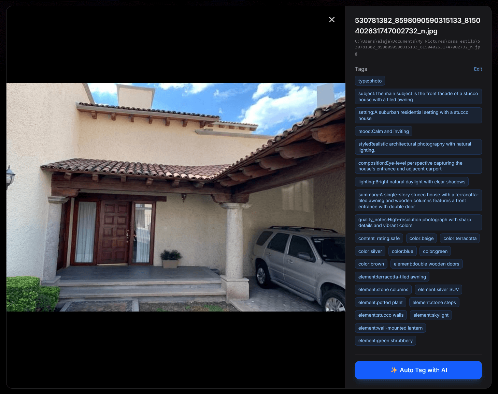
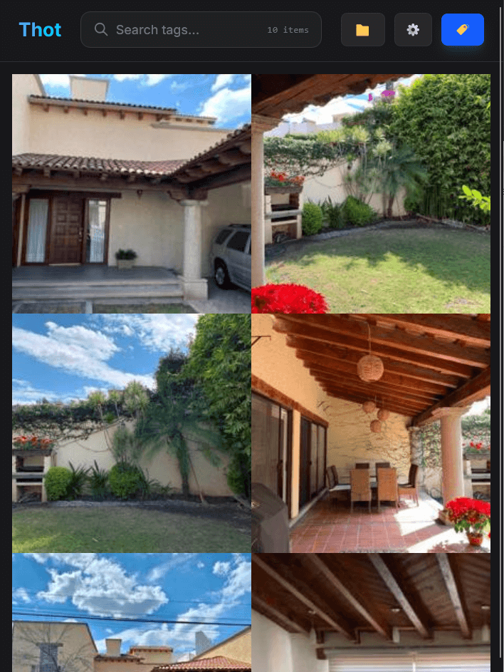
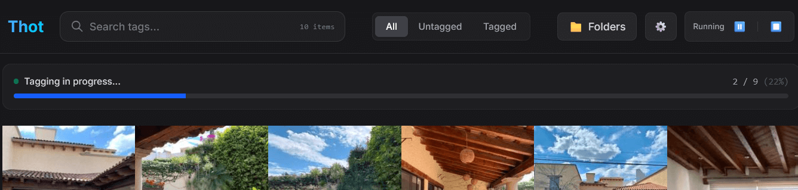

# Thot - Private Image Gallery & Tagger (by Mr.Jack)

Thot is a self-hosted image gallery and tagging application that uses local AI to analyze and organize your image collection.

## Features

- **Local AI Tagging:** Uses Ollama and vision models (like Qwen3-VL) to automatically describe and tag images.
- **Watched Folders:** Monitor directories for new images and automatically process them.
- **Smart Search:** Search by tags, partial matches, or specific fields (e.g., `character:name`).
- **Duplicate Detection:** Identifies duplicate images using perceptual hashing.
- **Queue System:** Robust background processing for tagging large collections.

## Screenshots


*Tags generated*


*Image gallery with search capabilities*


*Queue system for auto-tagging*

## Prerequisites

- **Python 3.10+**
- **Node.js 18+**
- **Ollama:** Installed and running with the required model (default: `huihui_ai/qwen3-vl-abliterated:8b`).

## Installation

### Backend

1.  Navigate to the backend directory:
    ```bash
    cd backend
    ```

2.  Create a virtual environment:
    ```bash
    python -m venv venv
    ```

3.  Activate the virtual environment:
    - **Windows:** `venv\Scripts\activate`
    - **Linux/Mac:** `source venv/bin/activate`

4.  Install dependencies:
    ```bash
    pip install -r requirements.txt
    ```

5.  Configure environment variables:
    - Copy `.env.example` to `.env`:
        ```bash
        cp .env.example .env
        ```
    - Edit `.env` if necessary (defaults are usually fine for local development).

6.  Run the backend:
    ```bash
    python main.py
    ```
    The server typically runs on `http://localhost:8000`.

### Frontend

1.  Navigate to the frontend directory:
    ```bash
    cd frontend
    ```

2.  Install dependencies:
    ```bash
    npm install
    ```

3.  Configure environment variables:
    - Copy `.env.example` to `.env`:
        ```bash
        cp .env.example .env
        ```
    - Ensure `VITE_API_URL` points to your backend (default: `http://localhost:8000`).

4.  Run the development server:
    ```bash
    npm run dev
    ```
    Open your browser to `http://localhost:5173`.

## Usage

1.  **Add Folders:** Go to "Settings" -> "Watched Folders" and add local directories to scan.
2.  **Scan & Tag:** Use the "Scan All" or individual "Scan" buttons. Images will be added to the database.
3.  **Search:** Use the search bar to find images by tags or descriptions.
